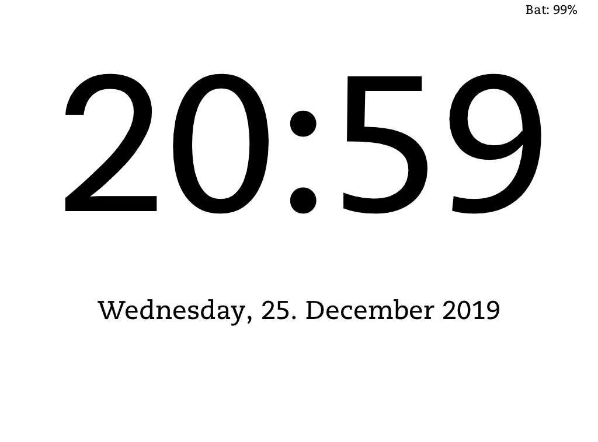

# Kindle Clock

This turns a Kindle Paperwhite into a clock running from battery.
The device updates the screen and is put to suspend to RAM for the reminder of the minute.

This is in early development, we'll see how much the battery life can be approved.

* `kindle-clock.sh`: Main loop, displays clock, suspend to RAM and wakeup
* `config.xml`: KUAL config file
* `menu.json`: KUAL config file
* `restore.sh`: bail-out, restore kindle framework and display

### Kindle preparation:
* jailbreak the kindle (doh!)
* Install KUAL
* Install MRInstaller (this should be insalled anyway, additionally this includes fbink)

### Installation:
* create directory `/mnt/us/extensions/clock`
* copy everything to the newly created directory (or use `sync2kindle.sh`)

### Starting Clock
* Open up KUAL and press 'Clock'

### Stopping :
* Force reboot kindle by holding powerbutton ~10 seconds

###Todo:
* [x] Set time every hour via ntpdate, RTC seems to be awfully drifting
* [x] keep backlight off during update
* [x] optimize battery life, make updates quicker
* [ ] clean up code
