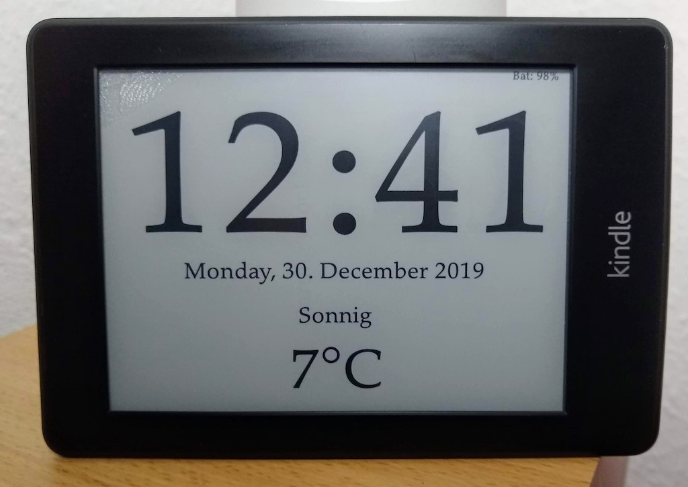

# Kindle Clock

This turns a Kindle Paperwhite into a pretty clock with a little bit of weather info.

Every minute the device updates the screen and is put to suspend to RAM for the reminder of the minute for minimum power consumption.

Every hour the clock is synchronized via `ntpdate` and weather info is updated. Screen updates can be a couple of seconds late (or dozens of seconds on the full hour - depending on how long it takes to reconnect to wifi, get data etc.) but as the RTC on my kindle is drifting like crazy anyway this clock will not be super (=to the second) accurate anyway.

This is in early development, we'll see how much the battery life can be approved.

EDIT: Quick calculation shows a maximum runtime of a couple of days at best. (1600mAh battery, using it for 5 secs @ 100mA every minute results in 8 days runtime)

But I don't mind running the clock from a power supply :)

## What's what
* `kindle-clock.sh`: Main loop, displays clock, suspend to RAM and wakeup
* `config.xml`: KUAL config file
* `menu.json`: KUAL config file
* `sync2kindle.sh`: simple rsync helper for development

The scipts logs to `/mnt/us/clock.log`.

## Kindle preparation:
* jailbreak the kindle (doh!)
* Install KUAL
* Install MRInstaller (this should be insalled anyway, additionally this includes fbink)

## Installation:
* create directory `/mnt/us/extensions/clock`
* copy everything to the newly created directory (or use `sync2kindle.sh`)

## Starting Clock
* Open up KUAL and press 'Clock'

## Stopping :
* Force reboot kindle by holding powerbutton ~10 seconds

## Todo:
* [x] Set time every hour via ntpdate, RTC seems to be awfully drifting
* [x] keep backlight off during update
* [ ] optimize battery life, make updates quicker
* [ ] clean up code
